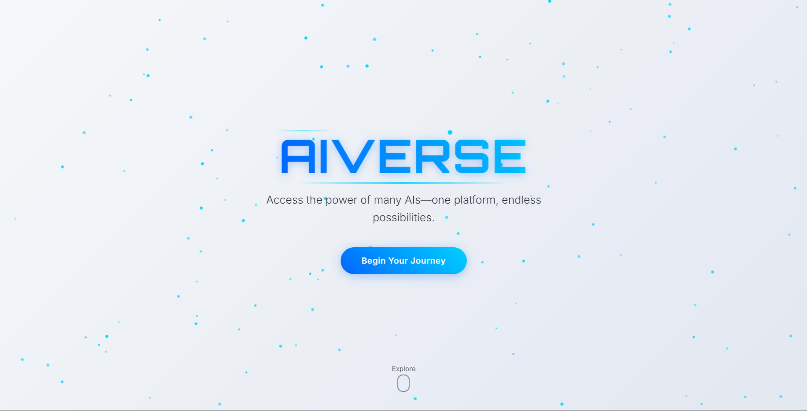
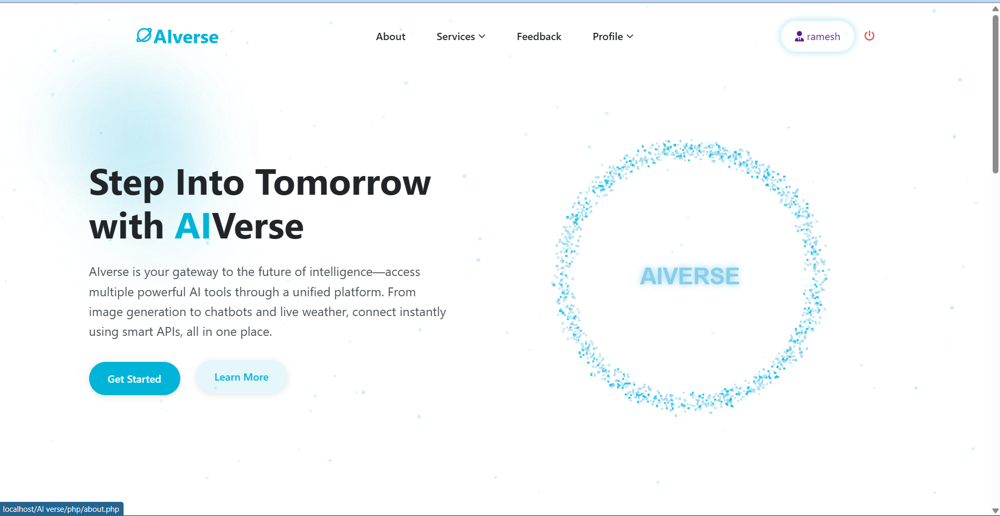

# 🌌 AIverse — AI-Integrated Smart Web Platform

<div align="center">
<br/><br/>

<p><b>An intelligent web platform that combines multiple AI services, interactive animations, and real-time data to deliver a futuristic user experience.</b></p>

<br/>


<br/>

[Overview](#-overview) · [Features](#-key-features) · [Tech Stack](#-technology-stack) · [Setup](#-local-setup-guide) · [Preview](#-preview) · [Developer](#-developer)

</div>

---

## 🤖 Overview

**AIverse** is an advanced web application that brings multiple AI capabilities together into a single unified platform.

The system integrates real-time AI chatbot communication, natural language summarization, AI image and avatar generation, and live weather information — all wrapped in a secure authentication system with smooth interactive animations.

> Built to explore how modern web development and artificial intelligence can work together to create next-generation smart platforms.

---

## 🖼️ Preview

<div align="center">
  
  <br/><br/>
  
</div>

---

## ✨ Core Highlights

- 🤖 AI-powered real-time chatbot interaction
- 🧠 Natural language text summarization
- 🖼️ AI image and avatar generation
- 🌦️ Live weather data integration
- 🔐 Secure login with session tracking
- 🎛️ Admin activity monitoring panel
- 🎨 Interactive GSAP and Three.js animations
- 📱 Responsive modern user interface

---

## 🚀 Key Features

| Module | Description |
|--------|-------------|
| 🤖 **AI Chatbot** | Real-time conversational AI powered by OpenAI GPT |
| 🧠 **NLP Summarizer** | Automatic text summarization using Cohere AI |
| 🖼️ **AI Image Generator** | Generate AI-created images via Stability AI |
| 👤 **AI Avatar Creator** | Create personalized AI avatars using DeepAI |
| 🌦️ **Weather System** | Live weather updates via OpenWeather API |
| 🔐 **Authentication** | Secure login system with session management |
| 🎛️ **Admin Panel** | Monitor platform activity and user interactions |
| 🎨 **Interactive UI** | Smooth GSAP animations and Three.js 3D effects |

---

## 🧠 Technology Stack

### Frontend


### Backend


### Animation & Graphics


### AI & External APIs


---

## ⚙️ Local Setup Guide

### Prerequisites
- XAMPP installed (Apache + MySQL)
- PHP 7.4 or higher
- API keys for: OpenAI, Cohere, Stability AI, DeepAI, OpenWeather

---

### Step 1 — Clone the repository

```bash
git clone https://github.com/Jatin021-22/AIVerse.git
```

### Step 2 — Move project to XAMPP

Place the project folder inside:

```
C:\xampp\htdocs\aiverse
```

### Step 3 — Database setup

1. Open **phpMyAdmin** → `http://localhost/phpmyadmin`
2. Create a new database named:
```
aiverse_db
```
3. Click **Import** and select the provided `.sql` file
4. Click **Go** to import

### Step 4 — Configure API keys

Open the config file and add your API keys:

```php
define('OPENAI_API_KEY', 'your_key_here');
define('COHERE_API_KEY', 'your_key_here');
define('STABILITY_API_KEY', 'your_key_here');
define('DEEPAI_API_KEY', 'your_key_here');
define('OPENWEATHER_API_KEY', 'your_key_here');
```

### Step 5 — Start XAMPP services

Open **XAMPP Control Panel** and start:
- ✅ Apache
- ✅ MySQL

### Step 6 — Open the project

```
http://localhost/aiverse
```

---

## 🔐 Demo Credentials

| Role | Username | Password |
|------|----------|----------|
| Admin | `Jatin` | `jatin12` |

---

## 🗺️ Future Improvements

- [ ] Add voice input support for the AI chatbot
- [ ] Integrate more AI models (Gemini, Claude)
- [ ] Add user dashboard with usage history
- [ ] Support multiple languages via translation API
- [ ] Deploy on cloud (AWS / Heroku / Railway)
- [ ] Add rate limiting and API usage tracking
- [ ] Mobile app version using React Native

---

## 👨‍💻 Developer

<div align="center">

**Jatin Prajapati**

*Full Stack Developer · AI Enthusiast*

[](https://github.com/Jatin021-22)

</div>

---

## 🌟 Project Vision

AIverse is built to explore how multiple AI technologies can be integrated into a single web ecosystem to create intelligent, interactive, and engaging digital experiences.

The project demonstrates the power of combining **modern web development** with **artificial intelligence** to build next-generation smart platforms that are both functional and visually compelling.

---

## 📜 License

```
© 2026 Jatin Prajapati. All rights reserved.
Released under the MIT License.
```

---

<div align="center">
  <i>AI Integration &nbsp;·&nbsp; Modern UI &nbsp;·&nbsp; Interactive Experience</i>
</div>
